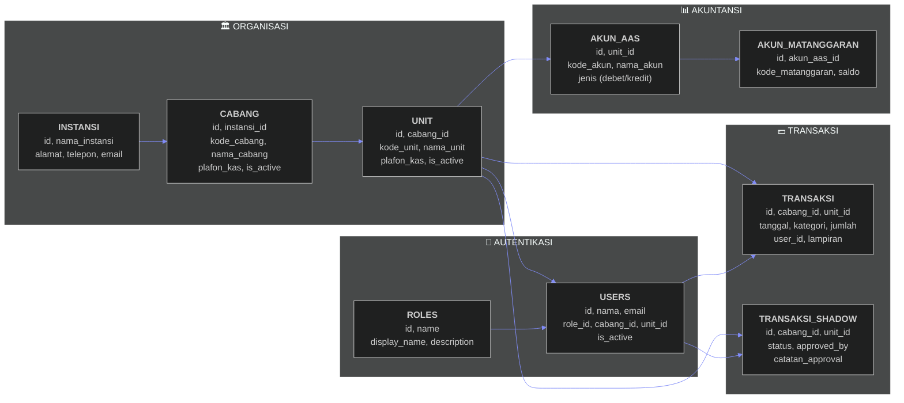

# Kas Kecil v4.0 - Imprest Methode App

 

Sistem pengelolaan kas kecil (Petty Cash) berbasis metode **Imprest (Dana Tetap)** dengan dukungan multi-platform (Web & Mobile).

## 📋 Overview

Aplikasi ini dirancang untuk menangani struktur organisasi multi-level dari Instansi hingga Unit kerja dengan alur kerja yang ketat namun fleksibel.

### Struktur Hierarki Organisasi
- **🏛️ Instansi**: Organisasi Induk (Contoh: YPI Al Azhar)
- **🏢 Cabang**: Kantor Regional (Contoh: Jakarta, Bandung)
- **📋 Unit**: Unit Keuangan, SDM, IT, dll.

## 💾 Database Logic (ERD)

Aplikasi menggunakan database relasional yang kompleks dengan 10+ tabel. Berikut adalah gambaran relasi utamanya:



## 🔐 Roles & Access Control

### 🔑 Super Admin (Highest Level)
Akses penuh ke semua data dan konfigurasi sistem.
- ✅ Kelola Semua Instansi, Cabang, dan Unit
- ✅ Atur Plafon Kas Per Unit sebagai Pembentukan Kas
- ✅ Kelola Semua User
- ✅ Lihat Semua Transaksi Unit
- ✅ Akses Laporan Konsolidasi & Rekap

### 📋 Admin Unit
Input transaksi untuk unit sendiri sesuai plafon kas.
- ✅ Kelola Akun AAS & Mata Anggaran
- ✅ Input Transaksi Pengeluaran & Pengisian
- ✅ Upload Bukti Transaksi
- ✅ Akses Laporan Unit

## 🔄 Workflow Bisnis

### 1. Setup Organisasi (Super Admin)
1. Login sebagai Super Admin.
2. Buat Data **Instansi**.
3. Buat Data **Cabang** & tentukan plafon.
4. Buat Data **Unit** & tentukan plafon kas awal.

### 2. Transaksi Harian (Admin Unit)
1. Login sebagai Admin Unit.
2. Setup **Akun AAS** & **Mata Anggaran**.
3. Input **Transaksi Pengeluaran** (Mengurangi Saldo).
4. Upload bukti lampiran (opsional).
5. Saldo akan berkurang otomatis sesuai nominal.

### 3. Pengisian Kas (Reimbursement)
1. Saat saldo menipis, Admin Unit input **Transaksi Pengisian**.
2. Saldo akan bertambah kembali (Top Up) mendekati atau sesuai plafon awal (Metode Imprest).

## ✨ Core Features

### 🏢 Manajemen Organisasi
- CRUD Instansi, Cabang, Unit.
- Manajemen User dengan Role-based Access Control (RBAC).

### 📊 Manajemen Akun
- Akun AAS (Debet/Kredit).
- Mata Anggaran dengan tracking saldo realtime.

### 💵 Manajemen Transaksi
- Input transaksi dengan upload bukti (sampai 3 lampiran).
- Filter transaksi berdasarkan tanggal & kategori.
- Rekap transaksi harian.

### 📈 Laporan
- Dashboard summary.
- Export Laporan (PDF/Excel).
- Laporan Konsolidasi untuk Super Admin.

## 🛠️ Tech Stack

### Frontend & Mobile
- **Web**: React + Vite + Tailwind CSS
- **Mobile**: React Native (Expo)

### Backend
- **Framework**: Laravel 12 (PHP 8.2+)
- **Database**: PostgreSQL
- **Security**: Sanctum (Token-based Auth)

### Shared Packages
- **Turbo Repo**: Monorepo management
- **Zod**: Validation schema shared between FE/BE types.

## 🚀 Quick Start

```bash
# Install dependencies
pnpm install

# Start database services
pnpm docker:up

# Reset & Seed Database
pnpm db:fresh

# Run all apps (Web, API, Mobile)
pnpm dev
```

## 🔐 Default Credentials

| Role | Email | Password |
|------|-------|----------|
| **Super Admin** | `admin@kaskecil.com` | `password` |
| **Admin Unit** | `admin.unit@kaskecil.com` | `password` |
